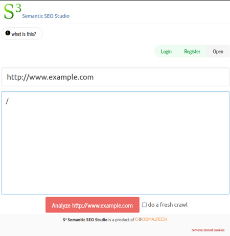
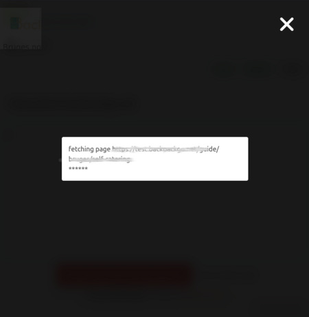
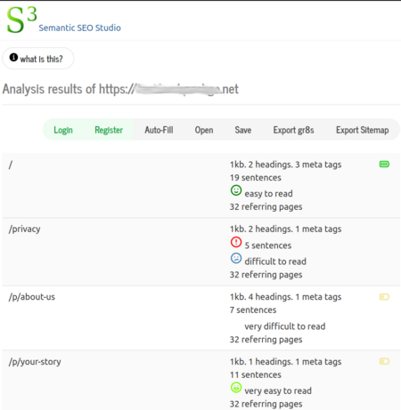

# Optimize your SEO with `gr8s` and `S3`

This guide will walk you through using two programs to optimize your SEO:

- [S³ - SEO Semantic Studio](https://s3.app.codoma.tech/) which analyzes
  your app and helps you author content (e.g. title, meta tags, etc).
- [`gr8s` frontend server](https://gr8s-server.codoma.tech/) which uses content from S³ to
  serve optimized content to search engines.

This workflow is meant for **dynamic** apps which would otherwise need SSR to
be search-engine friendly. Think apps made by React, Vue, Next.js.

## Preparing SEO Content

1. The first step is to include the [crawl assistant script](https://cdn.jsdelivr.net/npm/@codomatech/gr8s-tools/dist/s3s-crawl-assistant/s3s-crawl-assistant.js) in your app. The script should be included in all your app's pages.
  Note: the script simply helps capture the dynamic content of your app. It is intentionally unminified so it is open for inspection. The full source code is available [here](https://github.com/codomatech/gr8s-tools).
2. Head to the S³ at https://s3.app.codoma.tech/, enter your site's url and click "Analyze". Wait a few minutes
  while S³ crawls your app.

  

  

3. Once crawling and analysis is done, you will see a table of your pages with useful insights about each page.
  Click on a page to edit its meta tags, title, description, etc.

  

4. When you are happy with the content of each page, you have the following options:
    1. Some outcomes are ready to use, For example, the sitemap. Export the sitemap and submit it to Google and similar engines
    2. Install and configure `gr8s` to use the SEO content.
    3. If you don't want to use gr8s server, you can still integrate the gr8s data source
      (which follows a simple format in JSON) with your existing server infrastructure.


## Serving your SEO content with `gr8s`

### Preparing your app for `gr8s`

`gr8s` server needs specific tags in your HTML file to be able to inject SEO content.
This is why you need to use this [open source tool](https://github.com/codomatech/gr8s-tools) to post-process your files after your build them.

First, install `gr8s-tools`

```bash
# one of these
npm install -D @codomatech/gr8s-tools
pnpm install -D @codomatech/gr8s-tools
yarn add -D @codomatech/gr8s-tools
```

Then add the following command to your build script

```bash
# this is the minimum arguments, please execute with -h to see available options
gr8s-prepare-index-html -f v2/index.html
```

Now your HTML is ready to be served by `gr8s`

### Configuring and running `gr8s`


The easiest way to serve your app with `gr8s` is to use the Docker image `codomatech/gr8s`.
Assuming your app files are in directory called `dist` and your `gr8s` configuration file
is in a directory called `gr8s`, the following command start the server:

```bash
docker run -p 3080:3080 \
	--restart always \
	-v $PWD/dist:/app/html \
	-v $PWD/gr8s:/app/config \
	codomatech/gr8s --config /app/config/config.json
```

`gr8s` configuration file is a JSON file which, a among other things, points to the SEO
data you want to include in your app pages.

Example configuration:

```json
{
    "port": 3080,
    "servers": {
        "<your-site-domain>": {
            "is_spa": true,
            "root_directory": "/app/html",
            "template_datasource": {
                "file_path": "<your-data-path>"
            }
        }
    }
}
```

The configuration runs the server on port 3080. Serves your app under `your-site-domain` (replace with your actual domain)
as a single-page app. The root directory where your static files are is `/app/html`. Importantly, the data source
(which `gr8s` will use to inject SEO content in the file) are specific by `your-data-path`. The data path can be either:

- a path to a local file. For example, you can export a `gr8s` data source using S³ then upload it to your server.
- a URL to a file. If you choose to use S³ cloud, a URL of the data source is always
  available under deployment info in the toolbar.

In both cases, the data source is refreshed periodically. So your updates to the data source will appear on your app pages.
